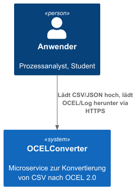
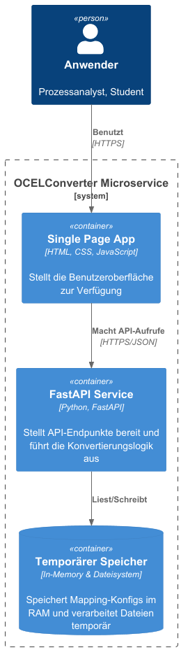
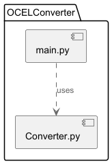
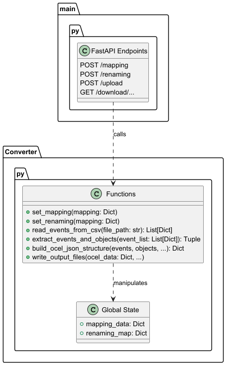
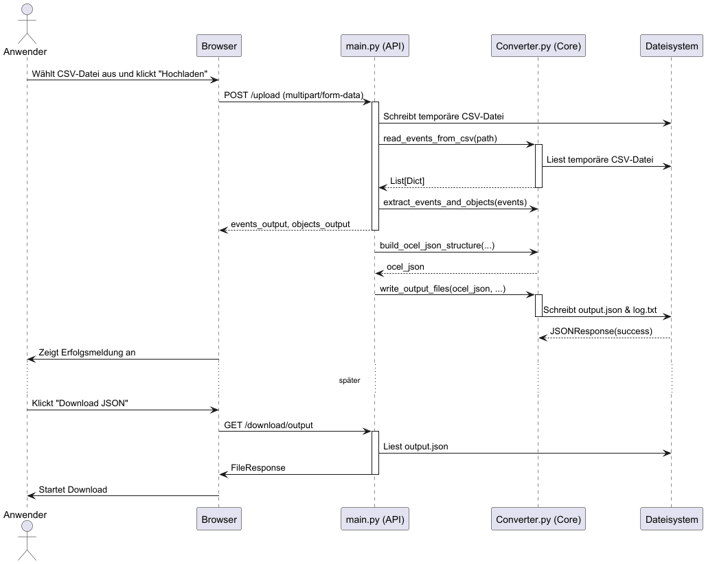

:project_name: OCELConverter
:author: Anne Panzer, Arthur Mehlgarten, Equal, Vincent Schick
:revdate: {docdatetime}
:doctype: book
:icons: font
:source-highlighter: highlightjs
:toc: left
:numbered:

= Entwicklerdokumentation __{project_name}__

== Einleitung

=== Aufgabenbeschreibung
NOTE: Diese Aufgabenbeschreibung ist aus der Perspektive des Anwenders (z.B. eines Prozessanalysten) verfasst.

"Wir besitzen diverse Prozess-Logs im CSV-Format, die aus unterschiedlichen Systemen exportiert wurden.  Diese Dateien enthalten Spalten wie eine `eventid`, `activity`, `completiontime`, `caseid` und `resource`.  Um moderne, objekt-zentrierte Process-Mining-Verfahren anwenden zu können, müssen diese Daten in das OCEL 2.0 Format überführt werden.

Wir benötigen ein einfach zu bedienendes Werkzeug, das über einen Webbrowser zugänglich ist. Dieses Werkzeug soll es uns ermöglichen:

* Eine CSV-Datei hochzuladen.
* Ein 'Mapping' zu definieren, bei dem wir bestimmte Werte (z.B. Ressourcen-IDs) zu übergeordneten Objekttypen (z.B. "Mitarbeiter", "Teamleiter") zuordnen können.
* Optional Ressourcen-IDs durch Klarnamen zu ersetzen, um die Lesbarkeit zu verbessern.
* Die Konvertierung mit einem Klick zu starten.
* Als Ergebnis eine valide OCEL 2.0 JSON-Datei und eine zusammenfassende Log-Datei herunterzuladen."

Das Hauptziel ist die Entwicklung eines webbasierten Microservices, der es Anwendern ohne Programmierkenntnisse ermöglicht, Event-Logs im CSV-Format in das OCEL 2.0 JSON-Format zu konvertieren.

== Randbedingungen

=== Hardware Spezifikation
* **Server**: Ein Server mit einem Betriebssystem, das Docker-Container ausführen kann (z.B. Linux).
* **End-User**: Ein Computer mit Internetverbindung und einem modernen Webbrowser.

=== Software Spezifikation
* **Server-Laufzeitumgebung**: Docker.
* **Anwendungs-Framework**: Die Anwendung basiert auf Python. Die notwendigen Bibliotheken sind in `requirements.txt` aufgeführt:
    * fastapi
    * uvicorn
    * python-multipart
* **Browser-Kompatibilität**: Die Weboberfläche ist für die Nutzung mit aktuellen Versionen von Google Chrome und Mozilla Firefox ausgelegt.

=== Vorgaben zum Betrieb der Software
Die Software wird als Webanwendung auf einem Server betrieben (z.B. in einem Docker-Container) und ist über einen Webbrowser zugänglich.  Die primären Nutzer sind Prozessanalysten oder Studierende, die sich mit Process Mining beschäftigen.  Es wird erwartet, dass sie über grundlegende Kenntnisse von CSV-Dateien verfügen, aber nicht zwangsläufig Programmierer sind.  Die Anwendung soll 24/7 verfügbar sein.  Eine technische Wartung durch den Endnutzer ist nicht vorgesehen.

== Kontextabgrenzung

=== Kontextdiagramm
Das System `OCELConverter` interagiert mit einem `Anwender` (z.B. Prozessanalyst). Der Anwender nutzt einen Webbrowser, um mit dem System zu kommunizieren. Er lädt Konfigurationen (Mapping, Renaming) und eine CSV-Datei hoch und lädt die generierten Ergebnisse (OCEL 2.0 JSON, Log-Datei) herunter. Das System selbst läuft als eigenständiger Microservice in einer Docker-Umgebung.

== Lösungsstrategie

=== Erfüllung der Qualitätsziele
[options="header"]
|===
|Qualitätzziel |Lösungsansatz
|*Benutzbarkeit* |
Die Weboberfläche ist als selbsterklärende Single-Page-Anwendung realisiert.  Alle notwendigen Schritte sind auf einer einzigen Seite durchführbar, was die Einarbeitung minimiert.  Visuelles Feedback informiert den Nutzer über erfolgreiche Aktionen oder Fehler.

|*Kompatibilität* |
Die Anwendung wird vollständig in einem Docker-Container gekapselt.  Dies stellt sicher, dass sie auf jedem System, auf dem Docker läuft, konsistent ausgeführt werden kann. Die Nutzung von Standard-Webtechnologien (HTML, Bootstrap) gewährleistet die Kompatibilität mit gängigen Browsern.

|*Zuverlässigkeit* |
Fehlerhafte Eingaben (z.B. ungültige JSON-Formate, doppelte `eventid` in der CSV) werden vom System abgefangen.  Anstatt abzustürzen, gibt das System eine verständliche Fehlermeldung an den Nutzer zurück und setzt die Verarbeitung aus.  Dies wird durch `try-except`-Blöcke und FastAPI's `HTTPException` erreicht.

|*Wartbarkeit* |
Der Code ist modular strukturiert: `main.py` ist für die API-Endpunkte und die Web-Interaktion zuständig, während die gesamte Konvertierungslogik in `Converter.py` gekapselt ist.  Dies erleichtert die Wartung und zukünftige Erweiterungen.
|===

=== Softwarearchitektur
Die Architektur ist ein klassisches Client-Server-Modell, das als Microservice realisiert ist.

* **Client**: Ein beliebiger moderner Webbrowser, der eine Single-Page-Anwendung anzeigt. Die Seite besteht aus HTML, CSS (Bootstrap) und minimalem JavaScript für die API-Kommunikation.
* **Server**: Ein FastAPI-Server, der in einem Docker-Container läuft. Er stellt die REST-API-Endpunkte bereit, bedient die HTML-Seite und führt die gesamte Geschäftslogik aus. Es gibt keine externe Datenbank; Konfigurationen werden temporär im Speicher gehalten.

=== Entwurfentscheidungen

* **Framework**: `FastAPI` wurde wegen seiner hohen Performance, der einfachen Bedienung und der automatischen Generierung von API-Dokumentation gewählt.
* **Persistenz**: Es wird bewusst auf eine Datenbank verzichtet, um den Service schlank und zustandslos zu halten. Die Mapping- und Renaming-Konfigurationen werden für die Dauer einer Session im Arbeitsspeicher des `Converter`-Moduls gehalten und können jederzeit zurückgesetzt werden.
* **User Interface**: Eine einfache Single-Page-Anwendung, die direkt vom FastAPI-Backend ausgeliefert wird. Das UI-Framework `Bootstrap` wird für ein sauberes und responsives Layout genutzt.

=== Benutzung externer Frameworks
[options="header"]
|===
|External library|Kategorie|Beschreibung
|FastAPI |Web Framework |Dient als Grundlage für den Microservice und stellt die REST-API bereit.
|Uvicorn |Web Server |Dient als ASGI-Server zum Ausführen der FastAPI-Anwendung.
|python-multipart |Kommunikation |Wird von FastAPI benötigt, um Dateiuploads zu verarbeiten.
|Bootstrap |UI |CSS-Framework für ein ansprechendes und responsives Design der Weboberfläche.
|===

== Bausteine

=== Komponentendiagramm
Das System besteht aus zwei Hauptkomponenten: dem API/Web-Layer und dem Konvertierungs-Core.

* **main.py**: Diese Komponente enthält die FastAPI-Anwendung. Sie definiert alle API-Endpunkte (`/upload`, `/mapping`, etc.), verarbeitet HTTP-Anfragen, validiert Eingaben und ruft die Logik in `Converter.py` auf. Sie ist auch für das Ausliefern der HTML-Oberfläche und das Senden von Antworten an den Client verantwortlich.
* **Converter.py**: Diese Komponente kapselt die gesamte Geschäftslogik der CSV-zu-OCEL-Konvertierung. Sie ist zustandslos bezüglich einzelner Anfragen, hält aber die globalen Mapping- und Renaming-Konfigurationen. Sie enthält Funktionen zum Einlesen von CSV-Dateien , zur Extraktion von Events und Objekten  und zum Erstellen der finalen OCEL-JSON-Struktur.

=== Klassen/Modul Beschreibung
Da das Projekt prozedural mit Funktionen und nicht objektorientiert mit Klassen geschrieben ist, zeigt das folgende Diagramm die wichtigsten Funktionen des `Converter`-Moduls und die Datenstrukturen (repräsentiert als Dictionaries), mit denen sie arbeiten.

== Laufzeitsicht

=== Sequenzdiagramm: Datein konvertieren
Das folgende Sequenzdiagramm illustriert den Ablauf des zentralen Anwendungsfalls `UC-01: CSV-Datei konvertieren`.

== Nachverfolgbarkeit: Anforderungen zu Design
Diese Tabelle stellt die Verbindung zwischen den definierten funktionalen Anforderungen (Analysemodell) und den implementierten Modulen/Funktionen (Designmodell) her.

[options="header"]
|===
|Anforderung (Analysemodell) |Implementierung (Designmodell)
|[[FR-01]] CSV-Einlesen & Bereinigen  |`Converter.read_events_from_csv()`
|[[FR-02]] Mapping-Konfiguration  |`Converter.set_mapping()`, globale Variable `Converter.mapping_data`
|[[FR-03]] Umbenennungs-Konfiguration  |`Converter.set_renaming()`, `Converter.apply_renaming()`, globale Variable `Converter.renaming_map`
|[[FR-04]] Event-Extraktion  |`Converter.extract_events_and_objects()`
|[[FR-05]] Objekt-Erstellung  |`Converter.extract_events_and_objects()`
|[[FR-06]] OCEL-Erzeugung  |`Converter.build_ocel_json_structure()`
|[[FR-07]] Log-Datei-Erstellung  |`Converter.write_output_files()`
|[[FR-08]] Download-Funktion  |`main.py` Endpunkte: `/download/output`, `/download/log`
|[[FR-09]] Reset-Funktion  |`main.py` Endpunkt: `/reset`, der `Converter.set_mapping({})` und `Converter.set_renaming({})` aufruft
|[[NFR-04]] Fehlerbehandlung bei doppelter eventid |`Converter.extract_events_and_objects()` prüft auf Einzigartigkeit und wirft einen `ValueError`
|===
