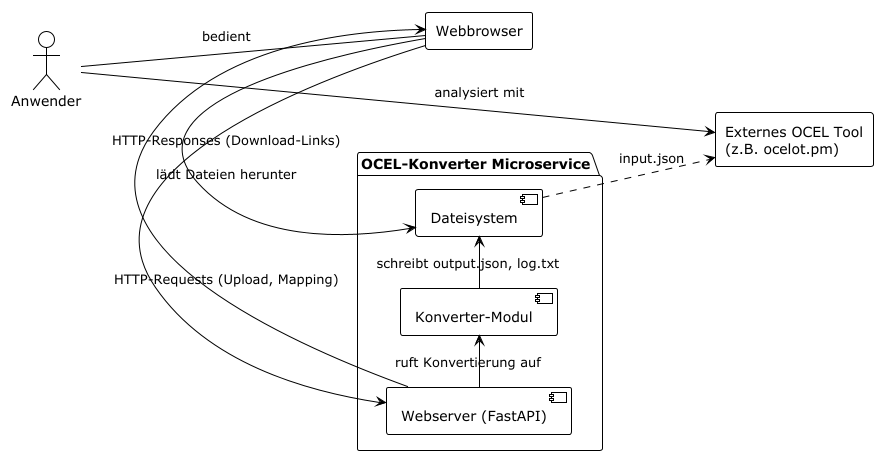
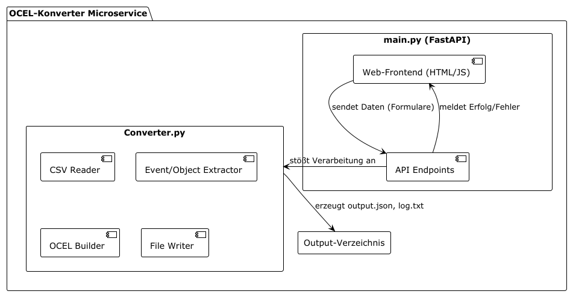
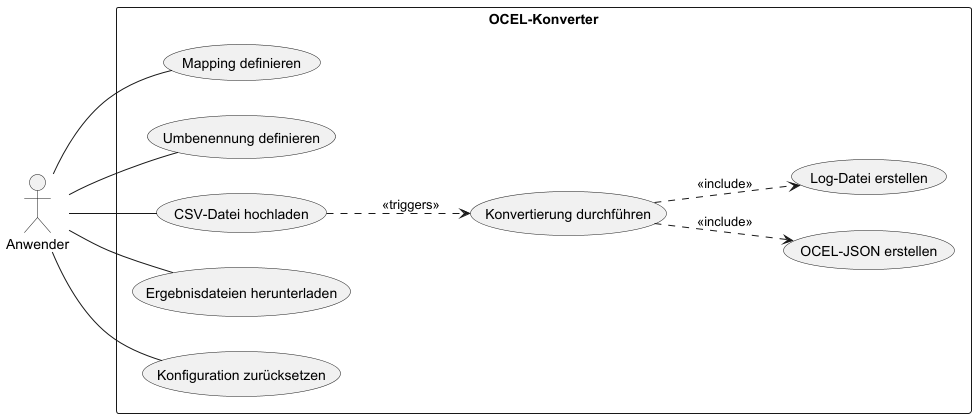
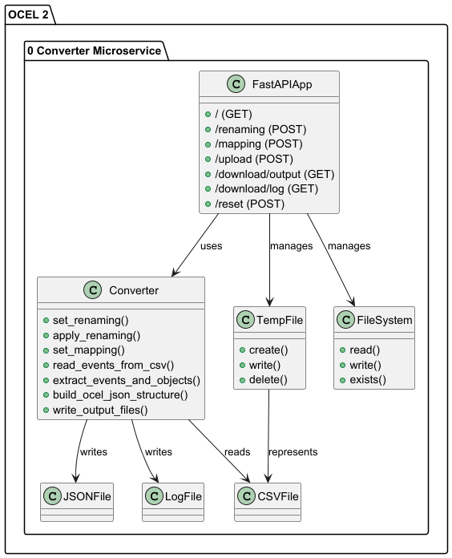

:project_name: OCELConverter
:author: Anne Panzer, Arthur Mehlgarten, Equal, Vincent Schick
:revdate: {docdatetime}
:doctype: book
:icons: font
:source-highlighter: highlightjs
:toc: left
:numbered:

= Lasten- und Pflichtenheft __{project_name}__

== Einleitung und Zielsetzung
Dieses Dokument dient als Anforderungs- und Spezifikationsdokument (Pflichtenheft) für das Projekt "OCELConverter". Es beschreibt die funktionalen und nicht-funktionalen Anforderungen an die zu erstellende Software. Das Ziel ist es, eine klare Kommunikationsgrundlage zwischen den Projektbeteiligten zu schaffen und die Anforderungen für die Entwicklung, den Test und die finale Abnahme festzuhalten.

Das Hauptziel des Projekts ist die Entwicklung eines webbasierten Microservices, der es Anwendern ohne Programmierkenntnisse ermöglicht, Event-Logs im CSV-Format in das OCEL 2.0 JSON-Format zu konvertieren. Dies soll die Anwendung von Process-Mining-Analysen auf flachen Datenstrukturen mit Werkzeugen wie ocelot.pm erleichtern.

== Aufgabenbeschreibung (Lastenheft)
Aus der Perspektive eines Anwenders (z.B. eines Prozessanalysten) stellt sich die Aufgabe wie folgt:

"Wir besitzen diverse Prozess-Logs im CSV-Format, die aus unterschiedlichen Systemen exportiert wurden. Diese Dateien enthalten Spalten wie eine `eventid`, `activity`, `completiontime`, `caseid` und `resource`. Um moderne, objekt-zentrierte Process-Mining-Verfahren anwenden zu können, müssen diese Daten in das OCEL 2.0 Format überführt werden.

Wir benötigen ein einfach zu bedienendes Werkzeug, das über einen Webbrowser zugänglich ist. Dieses Werkzeug soll es uns ermöglichen:

. Eine CSV-Datei hochzuladen.
. Ein 'Mapping' zu definieren, bei dem wir bestimmte Werte (z.B. Ressourcen-IDs) zu übergeordneten Objekttypen (z.B. "Mitarbeiter", "Teamleiter") zuordnen können.
. Optional Ressourcen-IDs durch Klarnamen zu ersetzen, um die Lesbarkeit zu verbessern.
. Die Konvertierung mit einem Klick zu starten.
. Als Ergebnis eine valide OCEL 2.0 JSON-Datei und eine zusammenfassende Log-Datei herunterzuladen."

== Produktnutzung und Stakeholder
=== Produktnutzung
Die Software wird als Webanwendung auf einem Server betrieben (z.B. in einem Docker-Container) und ist über einen Webbrowser zugänglich. Primäre Nutzer sind Prozessanalysten oder Studierende, die sich mit Process Mining beschäftigen und über grundlegende Kenntnisse von CSV-Dateien verfügen, aber nicht zwangsläufig Programmierer sind. Die Anwendung soll 24/7 verfügbar sein und auf gängigen, modernen Browsern (Chrome, Firefox) lauffähig sein. Eine technische Wartung durch den Endnutzer ist nicht vorgesehen.

=== Stakeholder

[options="header", cols="2, ^1, 4, 4"]
|===
|Name
|Priorität (1..5)
|Beschreibung
|Ziele

|*Anwender* (Prozessanalyst, Student)
|5
|Primärer Nutzer der Anwendung.
a|
- Schnelle & einfache Konvertierung von CSV zu OCEL
- Keine Programmierkenntnisse erforderlich
- Klare und verständliche Benutzeroberfläche

|*Entwickler*
|4
|Personen, die die Anwendung implementieren und warten.
a|
- Sauberer, modularer Code
- Einfache Erweiterbarkeit
- Nutzung moderner Technologien (FastAPI, Docker)

|===

== Systemgrenzen und Architektur (Pflichtenheft)
=== Systemkontextdiagramm
Dieses Diagramm zeigt das System und seine Interaktionen mit der Außenwelt.

=== Top-Level-Architektur
Dieses Diagramm zeigt die internen Hauptkomponenten der Anwendung.

== Anwendungsfälle
=== Akteure
[options="header"]
[cols="1,4"]
|===
|Name |Beschreibung
|*Anwender | Jede Person, die über den Webbrowser mit dem Dienst interagiert, um eine Konvertierung durchzuführen.
|*System*  | Der Microservice selbst, der die Verarbeitungsschritte ausführt.
|===

==== Use-Case-Diagramm

==== Use-Case Beschreibung
[cols="1h, 3"]
[[UC-01]]
|===
|ID                         |**<<UC-01>>**
|Name                       |CSV-Datei konvertieren
|Beschreibung               |Ein Anwender lädt eine CSV-Datei und die zugehörigen Konfigurationen hoch, um eine OCEL 2.0-Datei zu erzeugen.
|Akteure                    |Anwender, System
|Vorbedingungen             |Der Anwender hat eine CSV-Eventlog-Datei und JSON-Mapping bereit.
|Wesentliche Schritte:           a|

  1. Anwender gibt die Mapping-JSON im Textfeld ein und sendet sie ab
  2. Anwender wählt seine .csv-Datei über das Upload-Formular aus
  3. Anwender klickt auf "Datei hochladen & verarbeiten"
  4. Das System verarbeitet die Datei
  5. Das System meldet dem Anwender den Erfolg
  6. Anwender lädt die Ergebnisdateien über die Download-Links herunter
|===

== Funktionale Anforderungen (FR)
[options="header", cols="2h, 1, 3, 12"]
|===
|ID
|Version
|Name
|Beschreibung

|[[FR-01]]<<FR-01>>
|v1.0
|CSV-Einlesen
a|
Das System muss `.csv`-Dateien einlesen können. Spaltennamen müssen automatisch von Leerzeichen und unsichtbaren Zeichen (\ufeff) bereinigt werden.

|[[FR-02]]<<FR-02>>
|v1.0
|Mapping-Konfiguration
a|
Das System muss eine JSON-Struktur entgegennehmen, die Objekttypen auf Listen von Ressourcen-IDs abbildet. Dieses Mapping wird für die Konvertierung verwendet.

|[[FR-03]]<<FR-03>>
|v1.0
|Umbenennungs-Konfiguration
a|
Das System muss optional eine JSON-Struktur entgegennehmen, um Ressourcen-IDs durch Klarnamen zu ersetzen.

|[[FR-04]]<<FR-04>>
|v1.0
|Event-Extraktion
a|
Für jede Zeile der CSV muss das System ein Event-Objekt erstellen.

|[[FR-05]]<<FR-05>>
|v1.0
|Objekt-Erstellung
a|
Das System muss Objekte für die über das Mapping definierten Typen erstellen. Jedes Objekt muss eine eindeutige ID und einen Typ haben.

|[[FR-06]]<<FR-06>>
|v1.0
|OCEL-Erzeugung
a|
Das System muss eine valide OCEL 2.0 JSON-Datei erstellen.

|[[FR-07]]<<FR-07>>
|v1.0
|Log-Datei-Erstellung
a|
Das System soll eine Log-Datei erstellen, die eine Statistik über die Konvertierung enthält.

|[[FR-08]]<<FR-08>>
|v1.0
|Download-Funktion
a|
Das System muss Endpunkte bereitstellen, um die erzeugten Dateien herunterzuladen.

|[[FR-09]]<<FR-09>>
|v1.0
|Reset-Funktion
a|
Das System muss einen Endpunkt bereitstellen, der alle gespeicherten Mapping- und Renaming-Konfigurationen zurücksetzt.
|===

== Nicht-funktionale Anforderungen (NFR)
[options="header", cols="2h, 1, 3, 12"]
|===
|ID
|Version
|Name
|Beschreibung

|[[NFR-01]]<<NFR-01>>
|v1.0
|Benutzbarkeit
a|
Die Weboberfläche muss selbsterklärend sein. Alle notwendigen Schritte (Mapping, Upload, Download) müssen auf einer einzigen Seite durchführbar sein.

|[[NFR-02]]<<NFR-02>>
|v1.0
|Kompatibilität
a|
Die Anwendung muss in einem Docker-Container lauffähig sein. Die Weboberfläche muss mit aktuellen Versionen von Google Chrome und Mozilla Firefox kompatibel sein.

|[[NFR-03]]<<NFR-03>>
|v1.0
|Performance
a|
Das System soll CSV-Dateien mit bis zu 100.000 Zeilen in unter 30 Sekunden verarbeiten können (auf Standard-Hardware).

|[[NFR-04]]<<NFR-04>>
|v1.0
|Zuverlässigkeit
a|
Bei fehlerhaften Eingaben (z.B. ungültige JSON, doppelte `eventid` in CSV) muss das System eine verständliche Fehlermeldung an den Nutzer zurückgeben und darf nicht abstürzen.
|===

== GUI-Prototyp
Die Benutzeroberfläche wird als Single-Page-Anwendung realisiert. Das Design ist funktional und orientiert sich an einem klaren Drei-Schritte-Prozess:

* Abschnitt 1: Konfiguration
** Textfeld für das JSON Mapping
** Buttons zum Absenden der Konfiguration
** Button zum Zurücksetzen der Konfiguration

* Abschnitt 2: CSV-Upload
** Datei-Auswahl-Feld, das auf `.csv`-Dateien filtert
** Button "Datei hochladen & verarbeiten", um Konvertierung zu starten

* Abschnitt 3: Ergebnisse
** Download-Link für Output-Datei
** Download-Link für Log-Datei

Die Oberfläche nutzt Bootstrap für ein sauberes, responsives Layout. Feedback an den Nutzer (z.B. "Mapping gesendet", "Fehler") wird direkt auf der Seite angezeigt und verschwindet nach kurzer Zeit.

== Datenmodell
* *Eingangsmodell (CSV):* Eine flache Tabelle
* *Konfigurationsmodell (JSON):*
** Mapping
** Renaming
* *Ausgangsmodell (OCEL 2.0):* Die Struktur ist durch den OCEL 2.0 Standard definiert

=== Klassendiagramm

== Abnahmetests (Acceptance Testing)
[[AT-01]]
[cols="1h, 4"]
|===
|ID            |<<AT-01>>
|Use Case      |<<UC-01>>
|{Vorbedingung}        a|Anwender hat eine valide CSV und eine passende Mapping-JSON.
|{Event}      a|Anwender führt alle Schritte von UC-01 aus.
|{Ergebnis}     a|
- Die output.json wird erfolgreich erstellt und ist valides OCEL 2.0
- Die log.txt zeigt die korrekte Anzahl an Events, Objekten und Beziehungen
- Die Datei kann heruntergeladen werden
|===

[[AT-02]]
[cols="1h, 4"]
|===
|ID            |<<AT-02>>
|Use Case      |<<UC-01>>
|{Vorbedingung}        a|Anwender hat eine CSV-Datei mit doppelten eventids.
|{Event}      a|Anwender lädt die fehlerhafte CSV-Datei hoch.
|{Ergebnis}     a|
- Das System bricht die Verarbeitung ab
- Der Anwender erhält eine Fehlermeldung, die auf die doppelte eventid hinweist
- Es werden keine Output-Dateien erstellt
|===

[[AT-03]]
[cols="1h, 4"]
|===
|ID            |<<AT-03>>
|Use Case      |(Reset-Funktion)
|{Vorbedingung}        a|Anwender hat ein Mapping und Renaming gesendet.
|{Event}      a|Anwender klickt auf "Mapping & Renaming zurücksetzen".
|{Ergebnis}     a|
- Die serverseitigen Konfigurationen werden geleert
|===